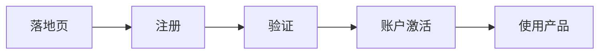

> 📖 **Friction** is “the psychological resistance that your visitors experience when trying to complete an action.” It’s also a conversion killer.

在产品的规划中，产品可以较为自由的优化产品的功能展现方式，任意调整操作引导按钮等产品内功能，尝试找出最大价值的产品形态。但是对于注册流程，却是一个不能做太多调整的功能，尤其是不能轻易的添加功能。

对于注册流程，减少用户的注册难度，是一个对于注册成功率提升非常明显的优化方向。但是，产品如果有没有分析整个流程，是很难找出那些阻碍用户注册的真正障碍的。

对于用户转化过程的阻力，可能来自产品的任意部分，我们先来集中分析以下注册流程中多发的阻力和阻力产品的原因。

## 注册流程中的阻力

注册过程中的阻力发现过程相对会比较难，一方面是部分感受难以量化，另一方面由于渠道间用户差异性，但产品层面还是可以找出可以作为消除阻力的基准体现形式：

* **注册步骤的数量。**

就是注册的步骤数量，在多数情况下表现为注册过程的页面数量。

* **需要信息的数量。**

就是用户需要填写的内容的数量。

* **做决定的次数。**
就是会让用户产生思考的次数，比如用户登陆邮箱，用户比对验证图形等。

通常来说，有三种常见的方式来设计注册的流程，以降低用户的注册阻力，在不同的场景下，每种方式优化的结果会有比较大的形态差异，优化后的注册流在与产品充分磨合后，就能最大化的提高用户注册率，从额提升产品体验。

## 三种常见注册流程（其一）

其实，现实中对于产品的优化方式会有很多，每一种都会有自己的优缺点，而且产品优化还是基于现实情况出发的，这里只是将常见的优化，总结为三种形式，来做交流探讨。

### 账户完成注册验证后可使用

这可能是最常见的一种注册流程。用户在注册过程中需要填写大部分信息后，再进行必要信息的验证，才能正常使用产品。

**这个流程有什么优势？**

首先，这个是最为常见的一种注册流程，用户对这种流程有着较长时间的被教育经验，一旦接触到这个流程。大部分用户几乎立即可以识别出，这是在注册账户，这时给出很少的提示就可以帮助用户完成这个流程。

另一个优势就是，这个流程可以提高注册用户的质量，因为需要验证关键信息，促使用户在注册流程中投入更多的资源（如邮箱、手机号等）。这会直接减少产品内不良内容产生的概率。

上图就是GitLab的一种注册流程的前半段，可以看出，填入信息后，会强制要求验证邮箱。只有完成邮箱的验证，才能正常使用产品。

**这个流程有什么劣势？**

显而易见，这个流程在用户使用产品前，会要求用户先提供信息，和验证邮件。对于信息的提前要求，是完成这个流程中最大的阻力。

用户在注册过程中，他们的注意力是非常宝贵的。可以把这一切想像成正在从太空服中泄漏的空气——你想趁它还在的时候，尽可能多的利用它。那么一切的阻力，都是产品经理应该排除的。如果选择了这个流程，那么在要求用户提供每个信息时，都要对这个信息的进行明确表述，来降低用户注册过程中，由于不解（或误解）产生阻力。

所以劣势可以表述为：让用户预先提注册供信息同时，还要理解这些信息对于注册很重要，并且建立起填写信息和完成验证的动力。

## 第一种流程总结

如果产品选择了这一种流程，就要确保用户知道完成每一个步骤的目的，且用户有足够动力和耐心完成注册。一旦用户的步骤结果预期与实际流程产生偏差，那么面临的大概率就是用户流失。

对于多数产品，重要的就是在注册过程中，对于产品如何使用信息的图文说明，以确保用户正确理解，消除对于提交信息后的疑虑。
