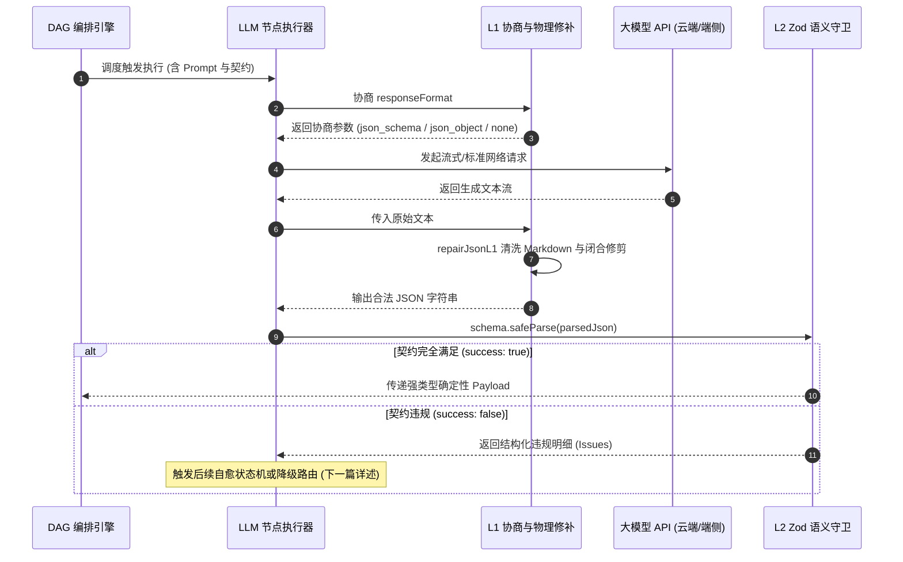

> **项目开源地址**：[https://github.com/GuoBug/PatchCat](https://github.com/GuoBug/PatchCat)  
> **在线体验**：[https://guobug.github.io/PatchCat/](https://guobug.github.io/PatchCat/)  
> **往期回顾**：  
> 📖 [《从 0 到 1 打造 AI 提示流编排器：别让 Agent 刷爆你的信用卡！运行时看门狗与死循环熔断器设计（开源系列 13）》]({{ '/posts/2026/09/22/ai-prompt-orchestrator-agent-runtime-guard-watchdog/' | relative_url }})  
> 📖 [《谁来为大模型的失控与手滑兜底？一个 Product Engineer 的「零信任」数字生存反思》]({{ '/posts/2026/09/23/ai-prompt-orchestrator-zero-trust-local-first/' | relative_url }})  
> 📖 [《从 0 到 1 打造 AI 提示流编排器：把 AI 引擎塞进华硕路由器！Merlin 插件与轻量边缘网关实战（开源系列 12）》]({{ '/posts/2026/09/22/ai-prompt-orchestrator-asuswrt-merlin-edge-gateway/' | relative_url }})

---


> **一句话**：L1 管 JSON 能不能 parse，L2 管 parse 出来的东西能不能用。这两件事没搞定之前，谈 Eval 打分没有意义。

---

## 一、架子搭完了，下一个坎在哪

PatchCat 这个项目本就是拿来边学 AI 边做开源（Learning by Doing），全程靠 AI 结对编程往前推。

迭代到这个阶段，能跑的东西已经不少了：

- 可视化画布，拖拖拽拽能连流程；
- 多流程抽屉式隔离管理，加上本地双模存储；
- 基于 Kahn 拓扑排序的 DAG 状态机调度骨架。

Demo 层面上，它算是个成型的项目了。但我想要的不是"截图好看"，而是同一条流程连跑一千次不崩。这两件事的距离，比看起来大得多。

往 EVAL（大模型系统评估）和企业级自动化流水线走的第一步，就卡住了。

原因是工作流的本质：它是一条确定性状态机流水线。节点 A 的输出直接是节点 B 的强类型输入，B 往哪条分支走，取决于 A 产出对象里的某个枚举或数值字段。

在聊天框里，模型开头加一句"好的，这是为您整理的数据："，或者结尾漏一个右括号，人眼会自动补上，不当回事。但在编排系统里，只要几十次调用里有一次吐出未闭合的括号、混进 Markdown 围栏、或者把数值 `1` 写成字符串 `"1"`，下游的 `JSON.parse` 或评分脚本就抛一个未捕获的 `SyntaxError`，整条 DAG 当场断掉。


- 脆弱的传统链路：`LLM 自由输出` $\to$ 混杂文本 / 残缺括号 $\to$ `JSON.parse()` 抛出 `SyntaxError` $\to$ 整条 DAG 中断；
- PatchCat 的做法：`LLM 节点` $\to$ `L1 约束解码协商 + 物理修补` $\to$ `L2 Zod safeParse 契约截流` $\to$ 强类型 Payload 交给下游节点和 Eval。

所以这一步没法跳过去。先把输出闭合，再谈评测。这就是 Module 0（确定性结构化输出与自愈状态机）的由来。

---

## 二、模型到底是怎么吐出结构化数据的

动手前我跟 AI 来回掰了几轮，两边关心的事不一样：

- 我提的是交互侧：用画布的人不该看到底层黑盒报错，调用失败也不能糊在脸上；
- AI 提的是工程侧：别迷信某一个 API 参数，OpenAI、DeepSeek、本地 Ollama 的底层解码能力差得很远，得先做能力协商再分层。

最后把结构化输出这件事拆成了三层：

```
L0（提示词软引导） ──> L1（受限解码物理防御） ──> L2（运行时业务契约守护）
```

### 1. L0：在 Prompt 里求它，然后用正则擦屁股

最原始的做法是在 System Prompt 里写狠话：

*“You MUST output strictly in valid JSON format. Do NOT include markdown code blocks, do not explain.”*

下游再用正则清洗：

```ts
// L0 时代的脆弱写法：靠运气运行
const cleanJson = responseText.replace(/```json/g, '').replace(/```/g, '').trim();
const payload = JSON.parse(cleanJson); // 随时面临语法崩溃
```

它有三个绕不过去的坑：

1. 自回归的概率机制让模型天然倾向于先说两句过渡语（"以下是分析结果："）；
2. 文本里出现未转义的英文双引号或换行，语法立刻破；
3. 长文本撞上 `max_tokens` 被截断，末尾括号没了，整个串失效。

### 2. L1：受限解码，在采样之前就动手

现代 LLM 框架引入的受限解码，思路不是"生成完了再修补"，而是在采样的物理阶段下约束。

算法大致是这样：

1. 维护一个由 JSON 语法构成的确定性有限状态自动机（DFA / CFG）；
2. 模型预测下一个 Token 的概率分布（Logits）时，语法引擎在采样前介入；
3. 把所有会让当前前缀违反 JSON 语法的候选 Token 的 Logits 置为 $-\infty$，也就是 Logits Masking；
4. 采样器只能在剩下的合法候选里掷骰子。

$$
\text{Logits}_{\text{masked}}(t) = \begin{cases} 
\text{Logits}(t), & \text{if } t \text{ is syntactically valid in CFG} \\ 
-\infty, & \text{otherwise} 
\end{cases}
$$

非法字符从根上就生不出来。

### 3. 厂商之间的差距，比文档写的还大

理论是这样，实际接模型时各家能力参差不齐。适配过程中记下来的真实差异：

| 厂商 / 模型端点 | 结构化支持级别 | 踩坑实录与边界特异性 |
| :--- | :--- | :--- |
| **OpenAI (gpt-4o)** | `json_schema` (Strict) | 原生支持严格 Logits 掩码，但约束很硬：Schema 里每个字段都得标 `required`，不支持递归引用。 |
| **DeepSeek** | `json_object` (JSON Mode) | 官方文档明确只支持 `json_object`，不支持严格 Schema；更麻烦的是文档里直接写着：*“在 JSON Mode 下，API 偶尔仍可能返回空内容”*。 |
| **本地 Ollama / 开源端点** | `none` (Prompt Only) | 往不支持 structured output 的端点强行传 `response_format`，服务端直接回 `HTTP 400 Bad Request`。 |

为了抹平这道坎，引擎里做了 `negotiateResponseFormat` 运行时协商分发：


- **Tier 1 (Strict Schema)**：给有原生受限解码的模型（如 gpt-4o），启用物理级 Logits 语法掩码；
- **Tier 2 (JSON Mode)**：给 DeepSeek 这类只支持 `json_object` 的端点，自适应启用并把 Schema 注入 Prompt；
- **Tier 3 (Prompt-Only)**：给本地 Ollama 这类弱端点，降级成格式引导加 Few-shot 样例，避免直接吃到 `HTTP 400`。

另外，Tier 2 和 Tier 3 下模型偶尔还是会带上 Markdown 围栏或者少个括号，所以在客户端前置了一个很轻的 `repairJsonL1`。它不是通用的 JSON 修复器，只干两件事：剥掉代码块外壳、补上结尾缺失的花括号。够用，而且不用引入额外依赖。

---

## 三、JSON 能 parse 了，为什么下游还是跑飞

搞明白 L1 之后，问题就变成了：既然模型吐的字符串已经能被 `JSON.parse()` 解析，为什么业务节点还是会出问题，为什么还是不能直接拿去做 Eval 断言。

答案就一句话，写在架构笔记的第一条：

> **L1 守物理语法，L2 守业务契约。**

语法合法，经常盖住的是业务语义崩了。下面三类是我实际踩到的。

### 1. 数值越界与枚举幻觉

工单自动分发场景，Prompt 要求把紧急程度 `urgency` 评估为 1 到 5。模型给出的 JSON 挑不出格式毛病：

```json
{
  "category": "logistics",
  "urgency": 9,
  "summary": "包裹长时间未更新物流信息"
}
```

`JSON.parse()` 顺利通过。但下游分发系统只配了 1~5 级流转队列，收到 `9` 找不到处理句柄，直接抛未定义异常。

### 2. 语义空壳与偷懒占位

键值对齐全，内容却是空串或占位符：

```json
{
  "category": "refund",
  "urgency": 3,
  "summary": "",
  "reasoning": "N/A"
}
```

语法检查放它过去了，下游依赖 `summary.length > 5` 生成摘要通知的逻辑当场被打穿。

### 3. 跨字段逻辑悖论

这是单字段校验看不见的死角：

```json
{
  "isRefundRequested": false,
  "refundAmount": 299.00,
  "reason": "仅咨询尺码问题"
}
```

没申请退款却带了退款金额；或者分类标了"退款"，必填的订单流水号却是 null。这种数据一旦落库，污染是实打实的。

### 4. L2：用 Zod 把契约立起来

TypeScript 的静态类型只在编译期保护开发者，挡不住运行时概率性的模型输出。

PatchCat 用 Zod 当整套系统的单一信任源：

1. 上游生成：开发者定义的 Zod Schema 一键转成标准 JSON Schema，注入请求参数（喂给 L1）；
2. 下游截流：拿到解析对象后，一律不用会抛异常的 `.parse()`，统一走 `.safeParse()`。

```ts
// 业务契约统一守卫：Single Source of Truth
export const TicketContractSchema = z.object({
  category: z.enum(['refund', 'logistics', 'complaint', 'other']),
  urgency: z.number().int().min(1).max(5),
  summary: z.string().min(5, '工单摘要至少需要 5 个字'),
  isRefundRequested: z.boolean(),
  refundAmount: z.number().nonnegative().optional(),
}).superRefine((val, ctx) => {
  // 跨字段业务契约强约束
  if (val.isRefundRequested && (!val.refundAmount || val.refundAmount <= 0)) {
    ctx.addIssue({
      code: z.ZodIssueCode.custom,
      message: '申请退款时必须提供大于 0 的退款金额',
      path: ['refundAmount'],
    });
  }
  if (!val.isRefundRequested && val.refundAmount && val.refundAmount > 0) {
    ctx.addIssue({
      code: z.ZodIssueCode.custom,
      message: '未申请退款时不应存在退款金额',
      path: ['refundAmount'],
    });
  }
});
```

越界数值、空壳字段、跨字段矛盾，都会在这一层被拦下并转成结构化错误列表，不再往下游流。

| 防御层级 | 核心关注点 | 拦截目标 | 失败代价 |
| :--- | :--- | :--- | :--- |
| **L0（纯 Prompt）** | 格式祈祷 | 粗粒度意图表达 | 高概率 SyntaxError 让主线程中断 |
| **L1（受限解码）** | 物理语法边界 | 未闭合括号、多余字符、Markdown 围栏 | 保证 `JSON.parse` 能过 |
| **L2（Zod 契约）** | 业务逻辑边界 | 数值越界、枚举捏造、空壳占位、跨字段冲突 | 保证下游代码和 Eval 断言拿到合规的强类型数据 |

---

## 四、串起来，拿脏数据试一遍

L1 和 L2 拼起来，就是 LLM 节点发起调用时的完整前置防线：



### 实测：故意喂脏数据

我构造了几组用例：括号故意不闭合、`urgency` 注入 9、`summary` 给空串、`isRefundRequested` 为 false 却带退款金额。跑下来，L1 把结构补齐，L2 拦住非法字段并给出 issue 明细，主事件循环全程没抛异常。


需要说明的是，这些是 Mock 注入的结果，不是线上真实流量的统计。真实分布还得等跑起来再看。

---

## 五、Eval 之前，先把账算清楚

从"搭出界面"到"啃完结构化输出"，我更确定一件事：判断一个 AI 架构成不成熟，不是看 Demo 能不能跑通一两次，而是看极限边界下连续跑一千次还能不能维持确定性。

但这两层防线都不是白来的，代价得记着：

- L1 的 strict schema 约束很硬，字段必须全 `required`、不支持递归引用，复杂嵌套结构的表达力会被削掉一截；
- Tier 3 端点压根没有物理约束，最终还是靠概率，只是把失败率压低了，不是清零；
- L2 契约越严，触发重试越多，延迟和 token 成本跟着涨。

这些都会变成后面做 Eval 时要一起权衡的变量。

模型自回归生成的创造力是真的，随机性也是真的。我要做的不是压掉创造力，而是给它铺两条铁轨，让概率性的东西在可控范围内跑。Eval 的前提也就在这：输入输出如果还是不可预测的自由文本，断言写得再多也是脆的；只有数据收敛成强类型、受契约约束的对象，自动化评分和指标回归才站得住。

---

### 下一篇：带病历的自愈状态机

还剩一个更硬的问题：L2 抓到业务违规（比如 `urgency` 还是超标），就直接判这条工作流死刑吗？

很多系统的做法是原样把 Prompt 再发一遍。实测下来，这种同构重试绝大多数时候会让模型掉进同一个坑，越陷越深。

下一篇拆的就是这块：**《从 0 到 1 打造 AI 提示流编排器：终结同构死锁！三要素病历反馈与黄金示例自愈状态机（开源系列 15）》**，讲怎么让模型自己把自己的输出修好。

---

> **关于作者**  
> **郭强 (GuoBug)**，Product Engineer，做平台工程也做业务增长。目前主要在折腾 AI 工作流编排、DAG 状态机与确定性系统架构。  
> 开源项目与主页：[https://github.com/GuoBug](https://github.com/GuoBug) · [https://guobug.github.io](https://guobug.github.io)  
> 欢迎就工作流引擎架构、拓扑调度和低门槛开发体验交流指教。
