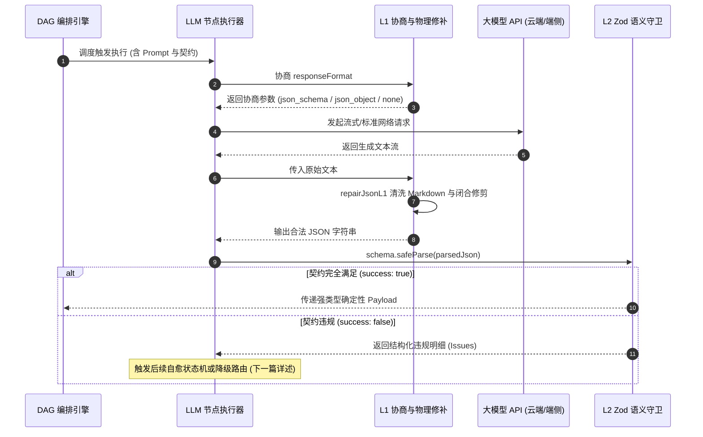

> **项目开源地址**：[https://github.com/GuoBug/PatchCat](https://github.com/GuoBug/PatchCat)  
> **在线体验**：[https://guobug.github.io/PatchCat/](https://guobug.github.io/PatchCat/)  
> **往期回顾**：  
> 📖 [《从 0 到 1 打造 AI 提示流编排器：别让 Agent 刷爆你的信用卡！运行时看门狗与死循环熔断器设计（开源系列 13）》]({{ '/posts/2026/09/22/ai-prompt-orchestrator-agent-runtime-guard-watchdog/' | relative_url }})  
> 📖 [《谁来为大模型的失控与手滑兜底？一个 Product Engineer 的「零信任」数字生存反思》]({{ '/posts/2026/09/23/ai-prompt-orchestrator-zero-trust-local-first/' | relative_url }})  
> 📖 [《从 0 到 1 打造 AI 提示流编排器：把 AI 引擎塞进华硕路由器！Merlin 插件与轻量边缘网关实战（开源系列 12）》]({{ '/posts/2026/09/22/ai-prompt-orchestrator-asuswrt-merlin-edge-gateway/' | relative_url }})

---


> **核心摘要 / Quotable Snippet**  
> **在进入大模型系统评估（Eval）与确定性编排之前，输出的强类型闭合是第一道不可逾越的生死线。** 缺少受限解码与业务契约兜底的评测，只是在流沙之上起高楼。确定性工作流编排从来不是为了扼杀 LLM 的创造力，而是在概率生成的湍流中，为整个软件系统装上由物理语法（L1）与业务契约（L2）构筑的工程安全气囊。

---

## 一、从“搭出架子”到“触碰核心”：边学边做的破局点

搭建 PatchCat 的初衷，始终是**“边学 AI 边做开源项目（Learning by Doing）”**。在整个研发过程中，我们全程深度依赖 **AI 辅助编程（AI Pair Programming）**，以敏捷共创的节奏推进系统演进。

在此之前，经过持续的迭代打磨，PatchCat 已经初步成型：
- 前端有了直观顺滑的可视化画布；
- 具备了多流程抽屉式隔离管理与本地双模存储；
- 依托 Kahn 拓扑排序算法，跑通了基础的 DAG 状态机调度骨架。

此时项目确实“有了个像模像样的架子”。但作为一名兼具平台工程与业务增长视角的 **Product Engineer**，我很清楚：**软件工程的胜负手绝不仅在于 Demo 演示有多炫酷，而在于系统在面对真实生产的极端场景时，能否稳稳跑上一千次而不崩溃。**

当我们准备迈出下一步，向 **EVAL（大语言模型系统评估体系）** 与企业级自动化流水线进发时，却迎面撞上了一堵冰冷的高墙：

**工作流的本质，是确定性的状态机流水线。**  
节点 A 的输出，直接作为节点 B 的强类型输入；节点 B 的 Condition 路由走向，完全依赖节点 A 产出对象中的关键枚举或数值字段。

在聊天界面（Chat）里，大模型偶尔自由发挥，开头带一句“*好的，这是为您整理的数据：*”，甚至漏掉结尾的一个反括号，普通用户都能凭借人脑的容错心智肉眼脑补；  
**但在确定性编排与自动化 Eval 断言体系中，这是毁灭性的打击。**

只要模型在几十次调用中，有一次吐出了未闭合的括号、混杂了 Markdown 围栏，或者把数值 `1` 吐成了字符串 `"1"`，下游的 `JSON.parse` 或评分脚本便会直接抛出未捕获的 `SyntaxError`，整条 DAG 拓扑执行立刻猝死中断。


* **脆弱的传统链路**：`LLM 自由输出` $\to$ 混杂文本 / 残缺括号 $\to$ `JSON.parse()` 抛出 `SyntaxError` $\to$ **整条 DAG 拓扑中断死锁**；
* **PatchCat 确定性防线**：`LLM 节点` $\to$ `L1 约束解码协商 + 物理修补` $\to$ `L2 Zod safeParse 契约截流` $\to$ **强类型 Payload 保证下游节点与 Eval 平稳运行**。

如果大模型吐出的数据连**结构闭合**与**强类型契约**都无法保障，我们如何谈论自动化的 Eval 系统评测？又如何奢谈准确率打分？那不过是在流沙上做基准测试。

**搞 Eval 评测前，必须先让输出闭合。** 这就是我们按下决心攻坚 Module 0（确定性结构化输出与自愈状态机）的根本原因。

---

## 二、底层原理深潜：大模型是如何生成结构化数据的？（从 L0 到 L1）

在推进这个关键架构决策时，我们展开了深度双向共创：
- **我提出产品交互痛点**：对于画布使用者而言，体验必须是“开箱即用”的低门槛设计，系统绝不能把底层黑盒报错或调用失败粗暴地糊在用户脸上；
- **AI 提出底层工程规约**：不能盲目迷信单一 API 参数，不同模型厂商（OpenAI、DeepSeek、本地 Ollama）的底层解码能力存在严重断层，必须进行能力协商与受限解码分层。

为了彻底吃透结构化输出，我们把大模型生成数据的机制从底层拆解为了三个层级：

```
L0（提示词软引导） ──> L1（受限解码物理防御） ──> L2（运行时业务契约守护）
```

### 1. L0 时代的原罪：提示词约束与脆弱的正则匹配
最原始的做法，是在 System Prompt 里用极尽严厉的措辞强调：  
*“You MUST output strictly in valid JSON format. Do NOT include markdown code blocks, do not explain.”*

下游代码则用脆弱的正则表达式清洗：
```ts
// L0 时代的脆弱写法：靠运气运行
const cleanJson = responseText.replace(/```json/g, '').replace(/```/g, '').trim();
const payload = JSON.parse(cleanJson); // 随时面临语法崩溃
```
这种做法的致命缺陷在于：
1. **礼貌性寒暄**：模型自回归概率机制决定了它倾向于输出自然的过渡语（如“以下是分析结果：”）；
2. **转义字符灾难**：文本内容中一旦出现未转义的英文双引号或换行符，JSON 语法即刻破裂；
3. **Token 上限截断**：长文本生成一旦触碰 `max_tokens`，末端括号缺失，直接导致全盘语法失效。

### 2. L1 的底层机制：什么是 Constrained Decoding（受限解码）与 Logits Masking？
进入 L1 时代后，现代 LLM 框架引入了受限解码技术。它不是“生成完毕后再修补”，而是**在模型采样的物理阶段施加语法约束**。

其底层算法机制为：
1. 维护一个由 JSON 语法构成的确定性有限状态自动机（DFA / CFG）；
2. 在大模型预测下一个 Token 的概率分布（Logits）时，语法引擎在**采样生成前**介入；
3. 将所有会导致当前前缀违反 JSON 语法的候选 Token 的 Logits 强行置为 $-\infty$（Logits Masking）；
4. 采样器只能在剩下的合法候选词中掷骰子。

$$
\text{Logits}_{\text{masked}}(t) = \begin{cases} 
\text{Logits}(t), & \text{if } t \text{ is syntactically valid in CFG} \\ 
-\infty, & \text{otherwise} 
\end{cases}
$$

从数学机制上，受限解码从根源上杜绝了非法字符的诞生。

### 3. 现实世界的厂商断层：PatchCat 的三级显式协商矩阵
然而，理论很丰满，多模型接入的现实却极其骨感。在多模型兼容适配中，我们记录下了真实的厂商能力断层：

| 厂商 / 模型端点 | 结构化支持级别 | 踩坑实录与边界特异性 |
| :--- | :--- | :--- |
| **OpenAI (gpt-4o)** | `json_schema` (Strict) | 原生支持严格 Logits 掩码，但约束极度严苛：Schema 内每个字段必须标为 `required`，不支持递归引用。 |
| **DeepSeek** | `json_object` (JSON Mode) | 官方文档明确说明仅支持 `json_object`，不支持严格 Schema；更值得注意的是，官方文档直白注记：*“在 JSON Mode 下，API 偶尔仍可能返回空内容”*。 |
| **本地 Ollama / 开源端点** | `none` (Prompt Only) | 若向不支持 structured output 的端点强行传递 `response_format` 字段，服务端会直接抛出 `HTTP 400 Bad Request` 导致调用猝死。 |

为了抹平这一工程鸿沟，PatchCat 在引擎中实现了 `negotiateResponseFormat` 运行时协商分发：


* **Tier 1 (Strict Schema)**：面向具备原生受限解码的模型（如 OpenAI gpt-4o），启用物理级 Logits 语法掩码；
* **Tier 2 (JSON Mode)**：面向 DeepSeek 等国产/开源主流端点，自适应启用 `json_object` 并将 Schema 自动注入 Prompt；
* **Tier 3 (Prompt-Only)**：面向本地 Ollama 弱端点或老旧端点，平滑降级为格式引导与 Few-shot 样例，杜绝调用抛出 `HTTP 400 Bad Request`。

同时，针对 Tier 2 和 Tier 3 下模型可能偶发的 Markdown 围栏或轻微未闭合情况，我们在客户端前置了极轻量的 `repairJsonL1` 物理修补管道：
在不依赖庞大外部依赖的前提下，以纳秒级速度剥离代码块外壳并自动配对补全尾部残缺的花括号，将 L1 层的物理语法解析成功率拉升至接近 100%。

---

## 三、关键工程认知跃迁：既然有了 L1，为什么还要死磕 L2？

在吃透 L1 受限解码后，一个核心问题摆在面前：  
*既然模型吐出的字符串已经 100% 能够被 `JSON.parse()` 成功解析，为什么下游业务节点依然会跑飞？为什么还不能直接拿来做 Eval 断言？*

答案沉淀为了我们在架构笔记中写下的第一条原则：
> **“L1 守物理语法，L2 守业务契约。”**

**“语法合法”往往掩盖了“业务语义崩溃”。** 大模型即使严格输出了合法的 JSON 格式，在业务维度依然充斥着三类经典陷阱：

### 1. 数值越界与枚举幻觉
在工单自动化分发场景中，Prompt 要求模型评估紧急程度 `urgency` 为 1 到 5。模型输出了格式无可挑剔的 JSON：
```json
{
  "category": "logistics",
  "urgency": 9,
  "summary": "包裹长时间未更新物流信息"
}
```
`JSON.parse()` 毫无压力地通过了。但下游的分发系统只配置了 1~5 级的流转队列，收到 `9` 时由于找不到处理句柄，直接抛出未定义异常。

### 2. 语义空壳与偷懒占位
模型生成了完备的键值对，但字段内容是无实质意义的空串或占位符：
```json
{
  "category": "refund",
  "urgency": 3,
  "summary": "",
  "reasoning": "N/A"
}
```
这种输出骗过了语法检查，却直接击穿了下游依赖 `summary.length > 5` 生成摘要通知的业务逻辑。

### 3. 跨字段逻辑悖论（Refinement 冲突）
这是单字段校验完全无法感知的死角：
```json
{
  "isRefundRequested": false,
  "refundAmount": 299.00,
  "reason": "仅咨询尺码问题"
}
```
未申请退款，却凭空附带了退款金额；或者工单分类标为“退款”，必填的“订单流水号”却为 null。这类业务逻辑打架的数据一旦流入下游数据库，会造成严重的数据污染。

### 4. L2 契约防御：基于 Zod 的零抛错截流
静态的 TypeScript 类型只在编译期保护开发者，面对动态且具备概率性的大模型输出毫无防御力。

PatchCat 选择以 **Zod** 作为整套系统的 **Single Source of Truth（单一信任源）**：
1. **上游生成**：将开发者定义的 Zod Schema 一键转换为标准的 JSON Schema，注入至请求参数中（赋能 L1）；
2. **下游截流**：在拿到解析对象后，坚决**严禁调用会抛出未受控异常的 `.parse()`**，而是统一走 `.safeParse()`：

```ts
// 业务契约统一守卫：Single Source of Truth
export const TicketContractSchema = z.object({
  category: z.enum(['refund', 'logistics', 'complaint', 'other']),
  urgency: z.number().int().min(1).max(5),
  summary: z.string().min(5, '工单摘要至少需要 5 个字'),
  isRefundRequested: z.boolean(),
  refundAmount: z.number().nonnegative().optional(),
}).superRefine((val, ctx) => {
  // 跨字段业务契约强约束
  if (val.isRefundRequested && (!val.refundAmount || val.refundAmount <= 0)) {
    ctx.addIssue({
      code: z.ZodIssueCode.custom,
      message: '申请退款时必须提供大于 0 的退款金额',
      path: ['refundAmount'],
    });
  }
  if (!val.isRefundRequested && val.refundAmount && val.refundAmount > 0) {
    ctx.addIssue({
      code: z.ZodIssueCode.custom,
      message: '未申请退款时不应存在退款金额',
      path: ['refundAmount'],
    });
  }
});
```

通过这一层防御，任何越界数值、语义空壳与跨字段悖论都会被精准拦截并提取为结构化的错误列表，杜绝向后污染。

| 防御层级 | 核心关注点 | 拦截目标 | 失败代价 |
| :--- | :--- | :--- | :--- |
| **L0（纯 Prompt）** | 格式祈祷 | 粗粒度意图表达 | 高概率 SyntaxError 导致主线程猝死 |
| **L1（受限解码）** | 物理语法边界 | 未闭合括号、多余字符、Markdown 围栏 | 物理级保证 `JSON.parse` 100% 成功 |
| **L2（Zod 契约）** | 业务逻辑边界 | 数值越界、枚举捏造、空壳占位、跨字段冲突 | 确保下游代码与 Eval 断言消费强类型合规数据 |

---

## 四、确定性防御链路落地与实机测试验证

将 L1 与 L2 串联起来，便构成了 PatchCat LLM 节点在发起调用时的完整前置防御流水线：



### 实测极端场景验证
为了检验这套防御机制的刚性，我们构造了包括语法残缺、越界数值注入、空字段以及跨字段逻辑矛盾在内的严苛测试用例。

在实机运行测试中，哪怕我们通过 Mock 工具故意注入了未闭合的代码块与边缘越界数据，L1 管道毫秒级自动完成修补闭合，L2 守卫严密截断非法字段并输出结构化检查项，工作流全程未抛出任何中断主事件循环的异常：


通过这套防御机制，工作流执行引擎从根源上摆脱了“提心吊胆等崩溃”的脆弱状态。

---

## 五、写在 Eval 前夜：给 Product Engineer 的工程思考

回看从“搭出界面架子”到“啃下结构化输出硬骨头”的过程，我更加坚信：
**一个成熟的 AI 架构，绝不是在 Demo 里凑巧跑通一两次，而是在跑一千次极限边界测试时依然维持系统的确定性。**

大模型的自回归生成拥有惊人的创造力，但也天然带有不可控的随机性。作为 Product Engineer，我们的使命不是剥夺这种创造力，而是通过受限解码（L1）与业务契约（L2）的工程组合拳，给概率性的湍流套上坚实的白盒铁轨。

**做 Eval（大模型系统评估）的前提，是系统拥有承载自动化评测的基建底座。**  
如果输入输出是不可预测的自由文本，所谓的 Eval 断言不过是脆弱的代码废纸；只有当数据收敛为强类型、受校验约束的确定性对象时，系统评估、自动化评分与科学指标回归才有了真正的立足之地。

---

### 下一篇预告：带病历自愈状态机与黄金示例

看到这里，你可能会提出一个更具挑战性的问题：  
*如果 L2 校验器抓到了模型的业务违规（比如 urgency 依然超标），难道直接给工作流判死刑报错吗？*

市面上很多系统选择“把原始 Prompt 机械地重新发一遍”，但在我们的实测中，这种同构重试有超过 80% 的概率会让大模型在同一个错误泥潭里越陷越深。

在下一篇文章中，我们将继续拆解 PatchCat 的进阶实战：  
**《从 0 到 1 打造 AI 提示流编排器：终结同构死锁！三要素病历反馈与黄金示例自愈状态机（开源系列 15）》**，揭秘如何让大模型自己修好自己的输出。

---

> **关于作者**  
> **郭强 (GuoBug)**，兼具平台工程底蕴与业务增长能力的资深 Product Engineer。  
> 专注于 **AI 工作流编排（AI Workflow Orchestration）**、DAG 状态机与确定性系统架构落地。  
> 开源项目与主页：[https://github.com/GuoBug](https://github.com/GuoBug) · [https://guobug.github.io](https://guobug.github.io)  
> 秉持“边写边学、双向共创”理念，欢迎围绕工作流引擎架构、拓扑调度及低门槛开发体验交流指教。
