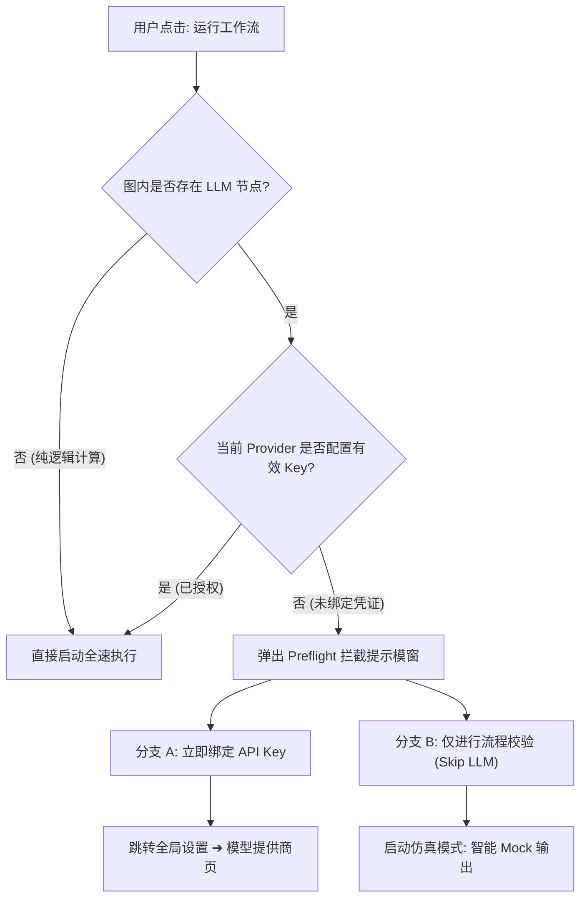

> 项目开源地址：[https://github.com/GuoBug/PatchCat](https://github.com/GuoBug/PatchCat)  
> 在线体验：[https://guobug.github.io/PatchCat/](https://guobug.github.io/PatchCat/)  
> 往期回顾：  
> 📖 [《从 0 到 1 打造 AI 提示流编排器：90% 流量零成本闭环！经济模型试探、语义门禁拦截与强模型轮换池自愈升级（开源系列 20）》]({{ '/posts/2026/10/02/ai-prompt-orchestrator-cheap-first-model-routing-and-cascade-fallback/' | relative_url }})  
> 📖 [《从 0 到 1 打造 AI 提示流编排器：别让 Agent 原地鬼打墙！连续 3 次相同工具调用的柔性引导与硬熔断（开源系列 19）》]({{ '/posts/2026/10/01/ai-prompt-orchestrator-agent-deadlock-and-circuit-breaker/' | relative_url }})  
> 📖 [《从 0 到 1 打造 AI 提示流编排器：失败了别全盘重来！逆向 BFS 拓扑回溯与 DAG 检查点断点续跑（开源系列 18）》]({{ '/posts/2026/09/30/ai-prompt-orchestrator-dag-checkpoint-and-reverse-bfs/' | relative_url }})  
> 📖 [《从 0 到 1 打造 AI 提示流编排器：告别“有进无出的上下文黑洞” —— 双锚点滑动窗口与原子事务裁剪实战（开源系列 17）》]({{ '/posts/2026/09/29/ai-prompt-orchestrator-context-engineering-dual-anchor-pruning/' | relative_url }})  
> 📖 [《从 0 到 1 打造 AI 提示流编排器：用一次“假药对照”，我们在大模型自愈中抓出了真凶（番外系列 2）》]({{ '/posts/2026/09/27/ai-prompt-orchestrator-placebo-control-and-empirical-closure/' | relative_url }})  
> 📖 [《从 0 到 1 打造 AI 提示流编排器：合规暴涨 23.9% 语义却跌 7.1%？自愈病理诊断与双轴归因报告（番外系列 1）》]({{ '/posts/2026/09/27/ai-prompt-orchestrator-eval-error-analysis-taxonomy/' | relative_url }})  
> 📖 [《从 0 到 1 打造 AI 提示流编排器：代码越写越脏？架构纯度清洗与 42 样本统计检验复盘（开源系列 16）》]({{ '/posts/2026/09/26/ai-prompt-orchestrator-architectural-purity-and-mcnemar-eval/' | relative_url }})  
> 📖 [《从 0 到 1 打造 AI 提示流编排器：别把大模型当机械拼图！Case #7 字段冻结陷阱与代码回滚复盘（开源系列 15）》]({{ '/posts/2026/09/25/ai-prompt-orchestrator-case-7-field-freezing-trap-and-rollback/' | relative_url }})  
> 📖 [《从 0 到 1 打造 AI 提示流编排器：搞 Eval 评测前，先让输出闭合！结构化约束与业务契约防线（开源系列 14）》]({{ '/posts/2026/09/25/ai-prompt-orchestrator-structured-output-eval-prerequisite/' | relative_url }})

---

> 导读：在图形化画布中编排复杂链路时，开发者最头疼的莫过于运行到中途突然中断。未配置 API 凭证导致下游报 401 失败、变量插值拼写错误导致运行时拿到 undefined、或是多分支条件遗漏了默认路由，都会让一次本可预防的调试耗尽数分钟等待与云端 Token。本文复盘 PatchCat 如何通过静态 AST 巡检、祖先传递闭包分析与契约级仿真沙箱，在请求发出前为工作流完成秒级无损体检。

---


## 一、 可视化编排的沉没成本：为什么非要在运行时才报错？

在构建生产级 **AI 工作流编排** 系统的探索中，我们发现用户在使用节点编辑器时存在一个普遍痛点：错误的暴露时序严重滞后。

传统的开发调试流程往往遵循盲目执行逻辑：用户拉入多个大模型节点、代码处理节点与多分支路由，连线完毕后点击“运行工作流”。此时系统自顶向下逐个执行，前两个节点顺利消耗了数百个 Token，耗时 5 秒；然而到了第三个节点，由于用户在提示词中手滑将变量名写成 `{{llm_1.outpoot}}`，或者节点引用的模型提供商尚未配置生效的 API 密钥，执行引擎抛出异常，整个流水线轰然断裂。

这种滞后报错带来了两重不可接受的代价：
第一是经济与时间损耗。上游节点已经产生的 Token 消耗无法追回，外部网络调用的等待时间全部沦为沉没成本；
第二是心智负担。当工作流扩展到数十个节点，复杂的菱形依赖与长链路会掩盖真正的问题源头，开发者不得不逐个翻看控制台堆栈来反推到底是哪根连线断开或哪个变量未声明。

解决思路显而易见：不能把所有安全校验都押注在运行时的网络请求阶段。一个合格的工作流引擎，必须在用户手指触碰运行按钮的第一时刻，通过毫秒级的静态扫描与受限推演，将拓扑死锁、语义断层与凭证缺失全部拦截在起跑线前。

---

## 二、 关键节点的双向共创：产品容错与图论规约的交汇

静态预检模块的落地，是产品体验诉求与图论工程规约相互启发的结果。

站在产品工程师的视角，我给团队提出了核心的可用性约束：
1. 零门槛免配置漫游：刚从模板中心导入新工作流的用户，往往只想快速探查整条链路的逻辑脉络，强迫用户必须立刻去设置面板粘贴有效 Key 才能点击运行，会极大打断探索心流；
2. 防御性直观指引：报错绝不能只是一串冰冷的系统 Toast。发现环路死锁或分支遗漏时，画布上的问题边与问题节点必须高亮报警，并提供一键定位与分支修复路径。

而在底层架构推演中，AI 搭档则指出了深层的图论漏洞与运行时隐患：
1. 幽灵变量依赖的时序竞争：在前端 DAG 引擎中，开发者可以在节点配置区任意输入 Mustache 变量模板（例如引用节点 `node_A` 的字段）。如果画布上并不存在一条从 `node_A` 指向当前节点的有向边，在并发拓扑分层调度中，当前节点完全可能先于 `node_A` 执行。这种幽灵依赖在静态单步测试中能侥幸通过，但在全图异步并发流转时必然引发空指针崩溃；
2. 仿真不能退化为纯文本假死：如果在免 Key 模式下只给大模型节点灌入一段静态的占位文本，下游依赖 JSON 字段解析的代码分发节点将直接崩溃。仿真推演必须理解上游的输出契约，具备局部结构化伪装能力。

这种业务直觉与系统边界的碰撞，共同推导出了由 **确定性工作流** 规约牵引的三层检查防线，并将其固化为 PatchCat 的 **DAG 状态机** 前置飞行检查标准。

---

## 三、 深入底层：三层静态拓扑巡检防线

为了在不消耗网络请求的前提下彻底排除拓扑隐患，我们在引擎执行入口前架设了一套纯前端静态分析流水线。


### 1. 拓扑环路与孤儿连线扫描

静态拓扑巡检的首要任务是保障图的有向无环性。基于 Kahn 算法计算全图节点的入度分布：

$$\text{inDegree}(v) = \sum_{e \in E} \mathbb{I}(e.\text{target} = v)$$

当入度为 0 的节点层级依次出队后，若遍历访问的节点总数小于全图活跃节点数，即判定图中存在环路死锁。此时系统立即冻结执行流水线，将涉及环路的节点 ID 集合与有向边全部赋予高亮脉冲样式，并在界面顶部弹出阻断通知。

同时，静态检查会遍历边集合 $E$，核验每一条连线的 `source` 与 `target` 是否真实存在于节点字典中。在复杂的画布多选删除或节点剪切操作中，偶发的孤儿边会被即时清理，防止底层调度器在反查前驱时读取空引用。

### 2. 条件节点分支覆盖度核验

在包含逻辑判断的流程中，条件节点（Condition Node）常常定义了多个目标出口（如 `if_true`、`else` 或自定义规则句柄）。

静态扫描程序会比对配置期望的分支集合与当前连接的出口边：

$$E_{\text{expected}} \setminus E_{\text{connected}} \neq \emptyset$$

一旦检测到某条分支处于悬空未连线状态，引擎并不会暴力终止全局运行，而是产出确定性静态警告。这既提示了开发者可能存在的逻辑死胡同，又避免了在草稿编辑阶段对局部未完成流程的过度打扰。

### 3. 幽灵变量依赖与逆向 BFS 传递闭包

这是整个静态检查中最关键的一道防线。在节点输入配置中，用户通过 `extractVariableReferences(str)` 提取出所有形态如 `{{nodeId.output.path}}` 的模板引用。


问题的隐蔽性在于：很多开发者以为只要节点在画布上，变量就可以全局读取。但事实并非全局共享内存，而是依赖显式的拓扑时序。

为了在毫秒级时间内断定引用的合法性，我们利用广度优先搜索构建每个节点的祖先传递闭包映射：

```typescript
// src/engine/topological-sort.ts
const ancestorsMap = new Map<string, Set<string>>();
const incomingMap = new Map<string, string[]>();

for (const edge of graph.edges) {
  if (!incomingMap.has(edge.target)) incomingMap.set(edge.target, []);
  incomingMap.get(edge.target)!.push(edge.source);
}

for (const node of graph.nodes) {
  const visited = new Set<string>();
  const queue = [...(incomingMap.get(node.id) || [])];
  while (queue.length > 0) {
    const parent = queue.shift()!;
    if (!visited.has(parent)) {
      visited.add(parent);
      const grandParents = incomingMap.get(parent) || [];
      for (const gp of grandParents) {
        if (!visited.has(gp)) queue.push(gp);
      }
    }
  }
  ancestorsMap.set(node.id, visited);
}
```

在提取出目标引用的 `refId` 后，检查规则执行两道断言：
1. `refId` 是否存在于当前画布的节点集合中？若不存在，报告引用了已删除的无效节点；
2. 若存在且不等于自身，断言 `refId ∈ ancestorsMap.get(node.id)`。若为假，意味着物理画布上没有任何一条有向路径从引用的源节点流向当前节点。

这就是典型的 **幽灵变量依赖 (Ghost Variable Dependency)**。引擎在此处精准阻断并发出警告，强制开发者补齐连线，从源头上杜绝了异步执行时因前驱未完成而取到空值的竞态陷阱。

---

## 四、 运行时仿真：双分支门禁与免 Token 沙箱推演

穿透了静态语法层之后，流程来到了凭证检查关卡。在用户按下运行按钮的一瞬，系统迅速排查图内是否存在大模型调用节点（LLM Node），以及当前激活的模型提供商是否已注入有效的 API Key。

### 1. 双分支预检拦截交互

如果工作流中包含大模型节点，但用户尚未绑定凭证，系统并不会直接抛错终止，而是触发 **双分支预检门禁**：



弹窗内清晰交代了当前检测到的模型服务商缺口，并将选择权交给用户：
- 意图上线真实业务的开发者，一键直达设置页面绑定密钥；
- 意图验证拓扑连通性的初学者或模板浏览者，直接进入 **仿真校验模式 (Dry-Run)**。

### 2. 具备契约感知力的智能 Mock 引擎

进入 `skipLLM: true` 模式后，大模型节点不再发起外部 `fetch` 请求，但也决不能仅仅返回一个无意义的死文本。

引擎底层配备了契约感知启发式机制，根据节点的配置标签与输入意图动态派发仿真数据：

```typescript
// src/engine/browser-engine.ts
const promptLower = userPrompt.toLowerCase();
const labelLower = node.data.label.toLowerCase();
const expectsJson =
  hasStructuredOutput ||
  Boolean(testScenario) ||
  promptLower.includes('json') ||
  labelLower.includes('intent') ||
  labelLower.includes('router') ||
  labelLower.includes('classifier');

if (expectsJson) {
  output = {
    response: JSON.stringify({
      intent: 'logistics_expedite',
      urgency: 4,
      requires_human: true,
      summary: `[Flow Validation] Simulated intent classification for "${node.data.label}"`,
    }),
    parsed: { intent: 'logistics_expedite', urgency: 4, requires_human: true },
    model: 'mock-simulation',
  };
} else {
  output = {
    response: `[Simulated LLM Output] Workflow validation completed for node "${node.data.label}".`,
    model: 'mock-simulation',
  };
}
```

针对意图分类与多路路由节点，系统输出符合业务断言规范的有效 JSON 结构；针对外部 HTTP 节点，若 URL 命中 `example.com` 或仿真域名，自动返回标准 200 Mock 载荷。

这意味着，工作流中后置的 JavaScript 代码节点、多分支 IF/ELSE 节点、以及数据聚合节点，均能在内存中接收到真实合规的结构体并顺畅执行。整条拓扑链条以 **零 Token 消耗** 和小于 80 毫秒的纯本地执行耗时全速跑通，完整验证了数据流分发、条件分支转移与聚合器汇聚的可靠性。

---

## 五、 代价、局限与边界条件：静态检查不是万能银弹

在落地这套机制的过程中，我们同样深刻认识到静态分析与本地仿真的工程边界。真实世界的系统设计永远伴随着取舍。

### 1. 静态 AST 对动态求值的盲区

基于正则表达式与 AST 提取变量模板，只能识别明确声明在 `{{nodeId.output}}` 形式下的静态字符串。如果用户在自定义 JavaScript 代码节点中使用了反射、动态拼接属性名，或者通过计算逻辑间接访问上游变量，静态分析器在编译期无法推导这种动态求值。过分严苛的静态规则可能会对合法的高级动态代码产生误报，因此对于脚本节点的深层变量访问，系统仅能退化为运行时的缺省守护。

### 2. 仿真覆盖率不等于语义真实度

仿真模式能够百分之百验证数据通道连通性、JSON 反序列化逻辑以及条件路由的走向，但它本质上无法验证真实大模型的认知表现。

Mock 引擎返回的标准物流意图可以让下游代码节点成功分发，但并不代表真实模型在面对用户千奇百怪、甚至夹杂对抗情绪的自然语言输入时也能做出同样精准的判断。我们必须在产品界面上向开发者明确区分：Dry-Run 解决的是结构与协议的正确性，而提示词的工程鲁棒性仍需依靠真实的在线评测集来验收。

### 3. 传递闭包在超大规模图中的计算损耗

当前在节点数 $N \le 100$ 的日常编排场景下，逆向 BFS 计算传递闭包的耗时小于 2 毫秒，对交互流畅度毫无影响。然而，传递闭包在最坏情况下的算法复杂度为 $O(V \cdot (V + E))$。如果未来出现包含数百个节点与复杂网状跨连的巨型企业级工作流，频繁在每次画布拖拽时全量重算闭包可能会引发微小的帧率卡顿。针对超大规模场景，依赖拓扑脏标记实现增量闭包更新，将是后续版本演进的必经之路。

---

## 六、 总结：把防御工事修在事故发生之前

在大模型应用走向工业化交付的今天，开发体验的优劣往往取决于系统对错误的包容度与响应速度。

如果把大模型执行比作一次跨越公网的长途飞行，那么代码语法与画布拓扑就是飞机起飞前的跑道。放任带有隐患的连线与缺失凭证的节点起飞，结果只能是在半空中解体并付出昂贵的故障代价。

通过静态拓扑扫描排查环路与悬空分支，通过传递闭包阻断幽灵依赖，通过契约感知的 Dry-Run 沙箱提供免 Key 验证，PatchCat 为开发者构建起一道兼顾严谨与友好的 **确定性系统架构** 护栏。让不确定的网络探索发生在确定的安全网络之上，这是平台工程给予生产力工具最坚实的支撑。

---

> 下一篇预告  
> 📖 [《从 0 到 1 打造 AI 提示流编排器：纯前端零依赖！500 行手写 BM25 倒排索引与 RRF 倒数排名融合实战（开源系列 22）》]({{ '/posts/2026/10/06/ai-prompt-orchestrator-zero-dependency-bm25-and-rrf/' | relative_url }})

---

> **关于作者**  
> **郭强 (GuoBug)**，Product Engineer，做平台工程也做业务增长。目前主要在折腾 AI 工作流编排、DAG 状态机与确定性系统架构。  
> 开源项目与主页：[https://github.com/GuoBug](https://github.com/GuoBug) · [https://guobug.github.io](https://guobug.github.io)  
> 欢迎就工作流引擎架构、拓扑调度和低门槛开发体验交流指教。
